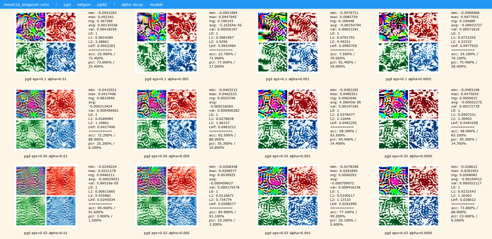

# Universal-Confusable-Perturbations

    When an adversarial attak is targeted for uniform distribution...

----

# CURRENTLY STILL WORKING ON ...

​    As far as I know, the concept of [Universal Adversarial Perturbations](https://arxiv.org/abs/1610.08401) stems from the DeepFool method, which optimizes one **common perturbation** (shaped like a single image, a.k.a. adversarial texture) so that most of images `x` in dataset `X` would be misclassified by the victim model `f` when this perturbation `dx` is added to as a noise signal, i.e. : `∀x∈X. P[f(x + dx) != y] -> 1`. It usually achieves this goal by leading the model to predict **another class** (either intended or not), However, this universal perturbation might still somehow contain information about this certain dataset.  

​    Now we consider of what if we **set the optimizing target to a uniform distribution**. That's to say: `∀x∈X. P[f(x + dx)] ~ U[0, 1]`. Intuitively we are searching for a **Universal Confusable Perturbation (UCP)** such that when added to a benign image, the victim classification model hesitates to make decisions. 

​    This sounds even weaker in adversarial attack scenario, but could we achieve better transferability across models/datasets by this way? <del> Even make a tool for bypassing existing AI censorshipments.</del>


### Experiments

We format our experiment name to indicate the experimental settings like: `<model>_<train_dataset>-<atk_dataset>_<method>` which means using `<model>` pretrained on `<train_dataset>` to search for UCPs on `<atk_dataset>` by `<method>` attack.

Here are currently available choices for each component:

```txt
model (all availables in `pytorch.models`)
  resnet18
  resnet50
  densenet121
  ...

train_dataset
  imagenet      // currently `pytorch.models` only provides weights for `imagenet`

atk_dataset (available through `pytorch.datasets`)
  mnist              // 28 x 28
  svhn               // 32 x 32
  cifar10            // 32 x 32
  cifar100           // 32 x 32
  tiny-imagenet (*)  // 64 x 64
  imagenet-1k (*)    // 224 x 224

method
  pgd
  pgdl2
  mifgsm

(*): see section "dataset download & preprocess" to download manually
```

#### run preset experiments

⚪ **attack_resnet18_imagenet-svhn_\*.cmd **

These presets try to generate UCPs on SVHN, then transfer to attack models pretrained on the intact ImageNet.

- run `attack_resnet18_imagenet-svhn_gridsearch.cmd` and `attack_resnet18_imagenet-svhn_ablations.cmd` to generated various UCPs under `log/<load_name>/<ucp_name>.npy`
- run `mk_img.cmd` to turn all `<ucp_name>.npy` to `<ucp_name>.png` , and save to `img` folder
- run `mk_stats.cmd` to test accuracy (acc) and prediction change rate (pcr) on imagenet-1k under ucp attack 
- run `mk_index.cmd` to generated a html for comprehensive view

now you can open `index.html` in your browser, it should look like:



``

⚪ **attack_resnet18_imagenet-imagenet-1k.cmd**

Generates from 1k examples of ImageNet's validation set to attack models pretrained on the intact ImageNet. So far no webpage for this :(

Experimental results shows an attack failure: the generated UCP is too flat and lack of texture, hence nearly cannot fool any model... :(


⚪ **attack_resnet18_imagenet-tiny-imagenet.cmd**

Generates from Tiny-ImageNet to attack models pretrained on the intact ImageNet. So far no webpage for this :(
**Note**: Tiny-ImageNet is NOT a subset of ImageNet, it has 200 classes and images are sized 64x64.

#### run a new experiment

```shell
# attack a certain model to generate a UCP
# => generates 'log/<load_name>/<ucp_name>.npy'
python attack.py -M resnet50 -D svhn --method pgd --eps 0.03 --alpha 0.001 --alpha_to 2e-5
# or attack multi models together
# => generates 'log/multi/<ucp_name>.npy'
python attack_multi.py -D svhn --method pgd --eps 0.03 --alpha 0.001 --alpha_to 1e-5

# test attack stats (acc/pcr)
# => updates 'log/stats.pkl'
python test.py -M resnet50 -D imagenet-1k --ucp log/resnet50_imagenet/resnet50_imagenet-svhn_pgd_e3e-2_a1e-3_to2e-5.npy
# for more test
python test.py -M resnet50 -D imagenet-1k --ucp log/resnet50_imagenet/resnet50_imagenet-svhn_pgd_e3e-2_a1e-3_to2e-5.npy --resizer tile --ex
# or attack other model
python test.py -M squeezenet1_1 -D imagenet-1k --ucp log/resnet50_imagenet/resnet50_imagenet-svhn_pgd_e3e-2_a1e-3_to2e-5.npy

# show ucp texture, clean pictures & added with ucp
# => generates 'img/<ucp_name>.png'
python show.py -M resnet50 -D imagenet-1k --ucp log/resnet50_imagenet/resnet50_imagenet-svhn_pgd_e3e-2_a1e-3_to2e-5.npy
```

#### dataset download

- 1k samples from ImageNet validation set: [imagenet-1k](https://pan.quark.cn/s/21953f83f874)
- Tiny-ImageNet: [tiny-imagenet-200](https://tiny-imagenet.herokuapp.com)

```
├── imagenet-1k
│   ├── image_name_to_class_id_and_name.json    <- index file
│   └── val
│       └── ILSVRC2012_val_*.png
│── tiny-imagenet-200
│   ├── test
│   ├── train
│   ├── val
│   ├── val_annotations.txt
│   ├── wnids.txt
│   └── words.txt
│── ...
```

#### troubleshoot

Q: It seems that loss is very high, and not decrease.
A: Don't worry, because Cross-Entropy Loss on a uniform distribution is naturally high, theoritical lower bound for a uniform distribution lengthed `1000` like ImageNet is the constant `6.9078`. Empirically, `attack.py` giving loss `~= 7.2` is good, while  `attack_multi.py` would give loss `~= 12.6`. To cheat all models is really mission impossible... :(


#### references

- Universal adversarial perturbations: [https://arxiv.org/abs/1610.08401](https://arxiv.org/abs/1610.08401)
  - PyTorch implementation: [https://github.com/NetoPedro/Universal-Adversarial-Perturbations-Pytorch][https://github.com/NetoPedro/Universal-Adversarial-Perturbations-Pytorch] 
- DeepFool: a simple and accurate method to fool deep neural networks: [https://arxiv.org/abs/1511.04599v3](https://arxiv.org/abs/1511.04599v3)
- Tiny-ImageNet-Benchmarks: [https://github.com/meet-minimalist/TinyImageNet-Benchmarks](https://github.com/meet-minimalist/TinyImageNet-Benchmarks)

----

by Armit
2022/09/27 
